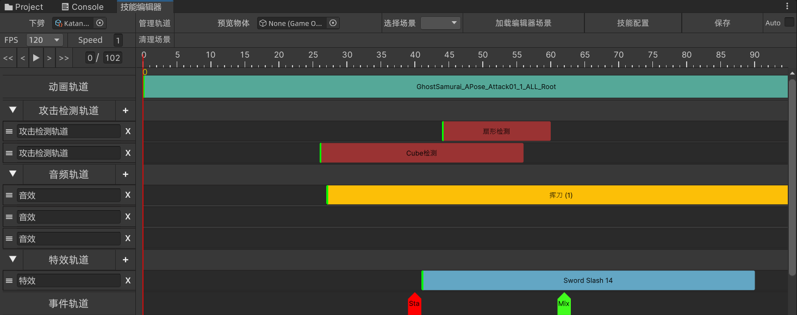

## 注意请勿修改项目结构

## 依赖

- AE_Framework [ancientElement/AE_Framework (github.com)](https://github.com/ancientElement/AE_Framework) 轻量的游戏框架
- AE_Animation_Playable [ancientElement/AE_Animation_Playable (github.com)](https://github.com/ancientElement/AE_Animation_Playable) 基于Playable 的动画系统
- Addressable
- URP(也可不用)

## 运行时示例使用

- 选择人物

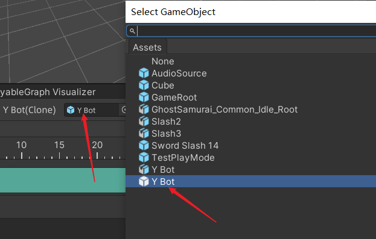

- 配置技能

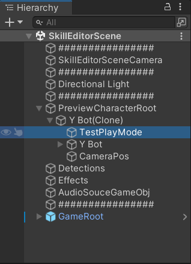

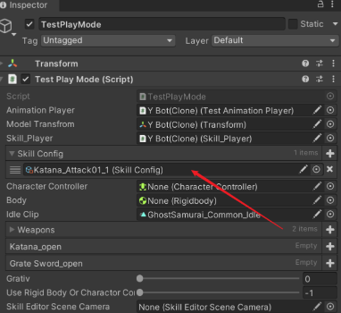

- 开始运行

- 点击任意数字键,按数字播放对应index的技能

## 轨道的播放

可以参考`TestPlayMode.cs`和` TestAnimationPlayer.cs`

`AE_Animation_Playable`的使用请移步至[ancientElement/AE_Animation_Playable (github.com)](https://github.com/ancientElement/AE_Animation_Playable) 

### 初始化

注意对`Skill_Player`进行初始化

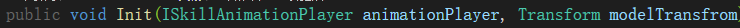

## 内置轨道

### 资源的创建与添加

- 创建资源

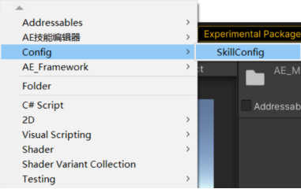

- 打开窗口

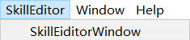

- 加载资源

  

- 添加轨道

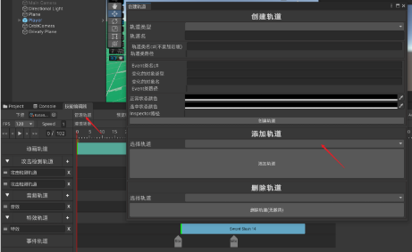

### 动画轨道

将AnimationClip直接拖入动画轨道即可生成动画Event,可以通过拖拽调整长度

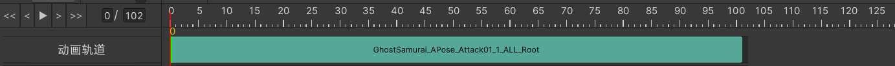

### 音频轨道

与动画轨道相同使用拖拽导入AudioClip,可以通过拖拽调整长度

动画轨道是多行轨道

可以同时播放多个音频

### 特效轨道

使用上与上相同,特效需要调整位置,在Scene中调整好位置后,右键此处保存当前位置

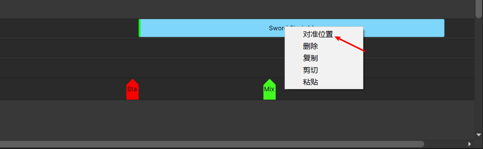

### 事件轨道

#### 添加事件

右键轨道空白处可以添加一个事件

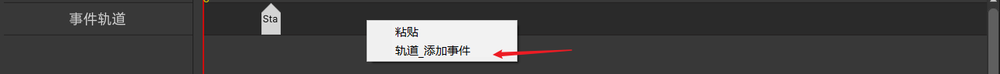

右键事件可以在同一个时间点添加多个事件

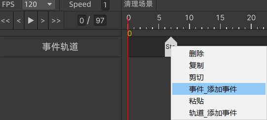

#### 面板

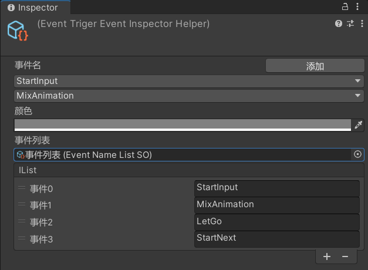

点击轨道中的事件出现面板

- 事件名之后的是当前帧触发的事件,可以有多个,点击事件弹出事件列表和删除选项

- 颜色是轨道上的事件颜色

- 事件列表可以存储需要的事件名方便多次添加

  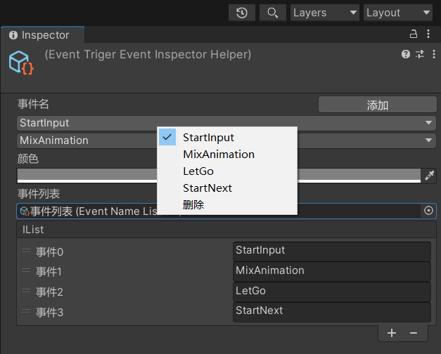

## 自定义轨道

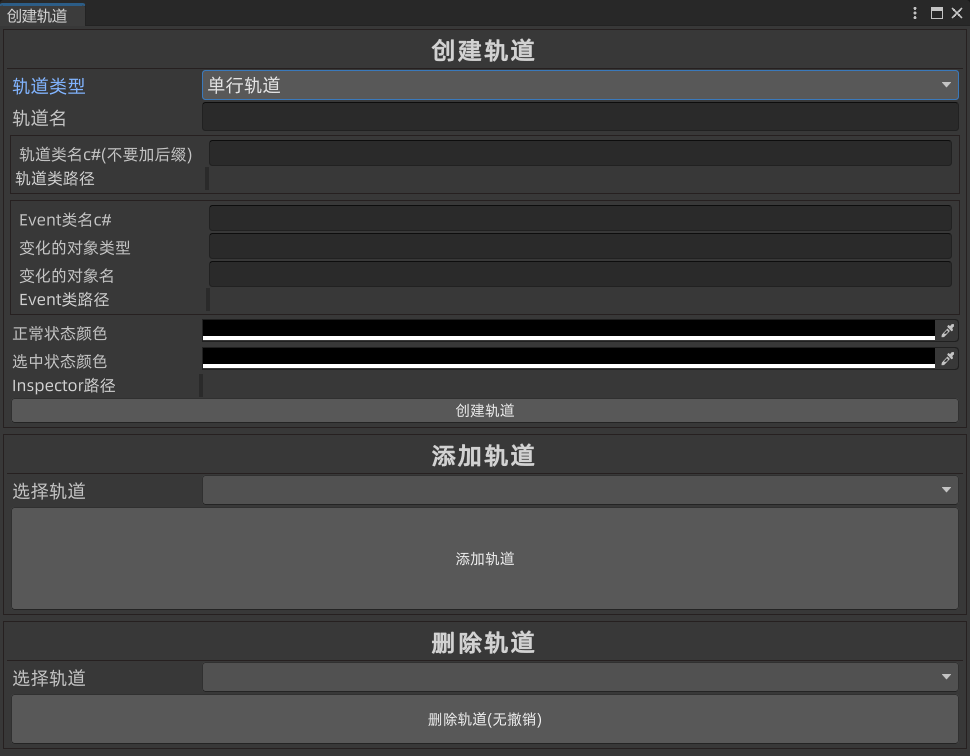

这里的内容很多文档还没有整理完成,可以大概通过注释了解